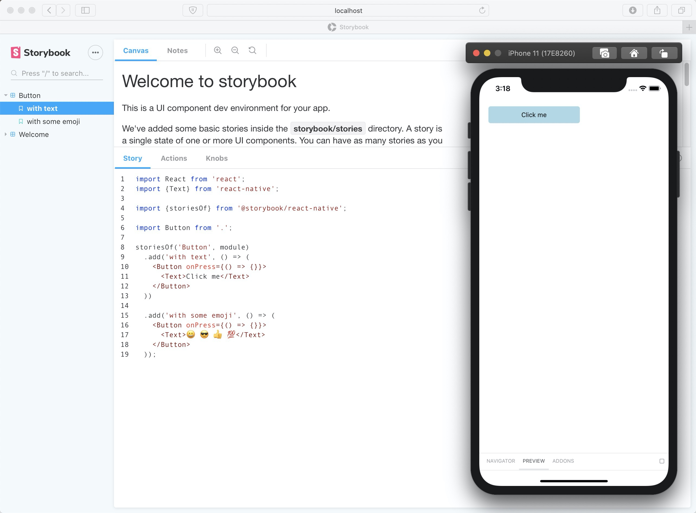

# react-native-storysource-transformer [](https://travis-ci.org/fabien88/react-native-storysource-transformer)

Enables storybook storysource addon for react-native.

## Purpose

This package makes [storysource](https://github.com/storybookjs/storybook/blob/master/addons/storysource) addon compatible with react-native which is not supported by [default](https://github.com/storybookjs/storybook/blob/master/ADDONS_SUPPORT.md).



## Installation and configuration

### Step 1 : install react-native-storysource-transformer library

```bash
yarn add react-native-storysource-transformer -D
```

### Step 2 : Configure the react native packager

#### For React Native v0.58 or newer

Merge your `metro.config.js` file with this config :

`metro.config.js`:

```js
module.exports = {
  transformer: {
    babelTransformerPath: require.resolve(
      "react-native-storysource-transformer"
    ),
  },
};
```

### Step 3 : install storysource addon

Install [storysource](https://github.com/storybookjs/storybook/tree/master/addons/storysource) addon and source-loader dependencies:

```bash
yarn add @storybook/addon-storysource --dev
yarn add @storybook/source-loader --dev
```

Add this line in your storybook/addons.js file :

```js
import "@storybook/addon-storysource/register";
```

### Step 4 (optional) : custom config

react-native-storysource-transformer is controlled by the react-native-storysource-transformer section of the project's package.json.

#### Options

| Setting                     | Type       | Description                                                                                                                                                   | Default                                                                                                                                             |
| --------------------------- | ---------- | ------------------------------------------------------------------------------------------------------------------------------------------------------------- | --------------------------------------------------------------------------------------------------------------------------------------------------- |
| **filePatterns**            | `string[]` | An array of blobs to match your stories files.                                                                                                                | `["**/*.stories.{js,ts}{x,}", "**/stories/index.{js,ts}{x,}"]` will match all files named \*.stories.js/jsx/ts/tsx and the default index story file |
| **storyMatcher** (Advanced) | `string`   | A regular expression used to parse a story. May be needed if your stories are not written using the usual convention : `storiesOf('Welcome', module).add(...` | `"(storiesOf.*?\\(.*?module\\))"`                                                                                                                   |

#### Examples:

Both examples below will search `src` and `packages` directories recursively for files that end with `.stories.js` and write the output to `./storybook/storyLoader.js`

##### `package.json`

```json
{
  "name": "AwesomeProject",
  "config": {
    "react-native-storysource-transformer": {
      "filePatterns": ["**/*.stories.js", "**/*.stories.jsx"]
    }
  }
}
```

You may need to run `yarn react-native start --reset-cache` if you change any of these options.

### Start

Run your storybook server and your storybook app as usual :

```bash
yarn storybook
```

```bash
react-native run-ios
```
